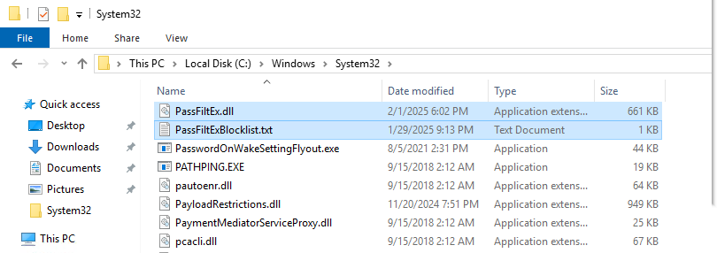
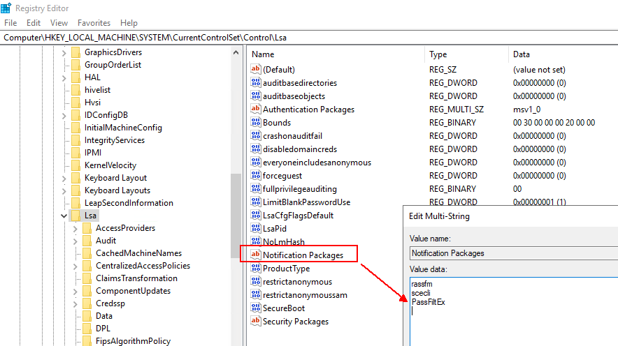
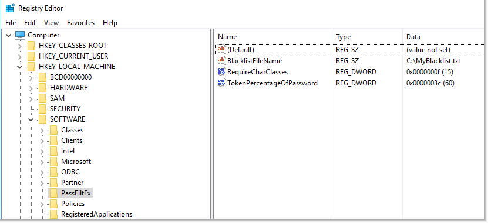
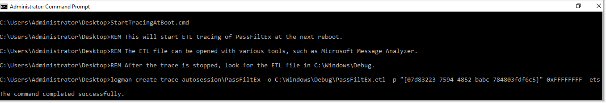
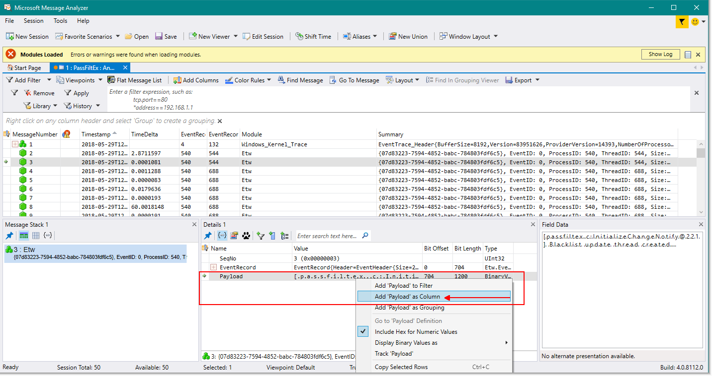
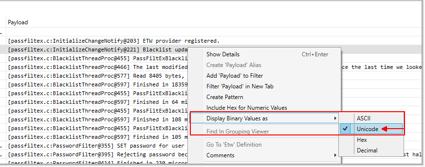
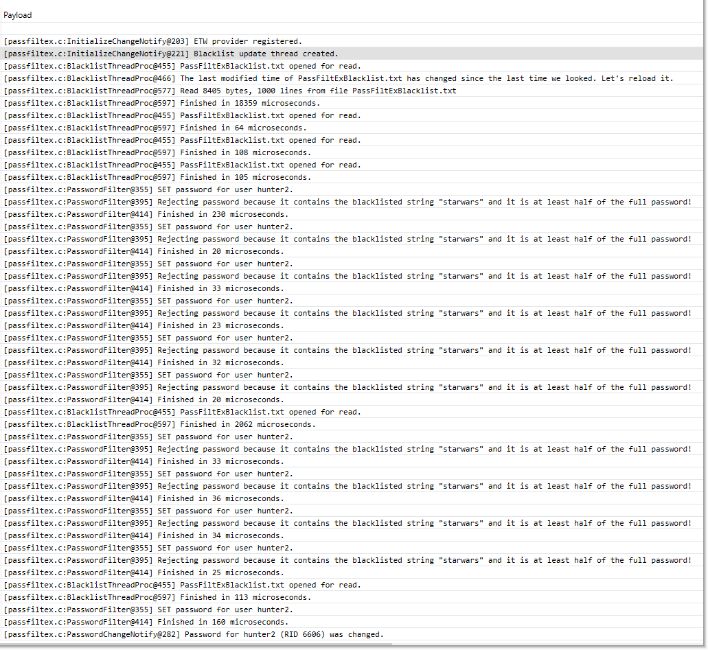

PassFiltEx.c

# PassFiltEx by Joseph Ryan Ries

Author: Joseph Ryan Ries 2019-2023 <ryanries09@gmail.com> <ryan.ries@microsoft.com>

A password filter for Active Directory that uses a blacklist of bad passwords/character sequences.

Reference: https://msdn.microsoft.com/en-us/library/windows/desktop/ms721882(v=vs.85).aspx

********************************************************************************************
# READ ME

This is a personal project and is NOT endorsed or supported by Microsoft in any way.

Use at your own risk. This code is not guaranteed to be free of errors, and comes

with no guarantees, liability, warranties or support.

********************************************************************************************

I wrote this just to join the club of people who can say that they've done it. Programming is fun.

Installation:

- Copy PassFiltEx.dll into the C:\Windows\System32 (or %SystemRoot%\System32) directory.

- Copy the PassFiltExBlacklist.txt file into the C:\Windows\System32 (or %SystemRoot%\System32) directory.

- (Or replace the text file with a list of your own. You are free to edit the blacklist file if you want.)

- Edit the registry: HKLM\SYSTEM\CurrentControlSet\Control\Lsa => Notification Packages

- Add PassFiltEx to the end of the list. (Do not include the file extension.) So the whole list of notification packages will read
  "rassfm scecli PassFiltEx" with newlines between each one.

- Reboot the domain controller.

- Repeat the above procedure on all domain controllers.

Operation:

- Any time a user attempts to change his or her password, or any time an administrator attempts to set a user's password, the 
  callback in this password filter will be invoked.

- All password filters must say yes in order for the password change to be accepted. If any password filter says no, the password 
  is not accepted. Therefore, this password filter does not need to check for password length, password complexity, password 
  age, etc., because those things are already checked for using the in-box Windows password policy.

- Optionally, you can set the following registry values:

  Subkey: HKLM\SOFTWARE\PassFiltEx
  
    **BlacklistFileName**, REG_SZ, Default: PassFiltExBlacklist.txt

	**TokenPercentageOfPassword**, REG_DWORD, Default: 60
	
	**RequireEitherLowerOrUpper**, REG_DWORD, Default: 0
	
	**MinLower**, REG_DWORD, Default: 0
	
	**MinUpper**, REG_DWORD, Default: 0
	
	**MinDigit**, REG_DWORD, Default: 0
	
	**MinSpecial**, REG_DWORD, Default: 0
	
	**MinUnicode**, REG_DWORD, Default: 0
	
	
	
	
	
  **BlacklistFileName** allows you to specify a custom path to a blacklist file. By default if there is nothing specified, it is
  PassFiltExBlacklist.txt. The current working directory of the password filter is %SystemRoot%\System32, but you can specify
  a fully-qualified path name too. Even a UNC path (such as something in SYSVOL) if you want. WARNING: You are responsible 
  for properly setting the permissions on the blacklist file so that it may only be edited and viewed by authorized users.
  You can store the blacklist file in SYSVOL if you want, but you must ask yourself whether you want all Authenticated Users
  to have the ability to read your blacklist file.
  
  **TokenPercentageOfPassword** allows you specify how much of the entire password must consist of the blacklisted token
  before the password change is rejected. The default is 60% if nothing is specified. The registry value is REG_DWORD, with 
  the value 60 decimal representing 60%, which is converted to float 0 - 1.0 at runtime. For example, if the character sequence
  starwars appeared in the blacklist file, and TokenPercentageOfPassword was set to 60, then the password Starwars1! would 
  be rejected, because more than 60% of the proposed password is made up of the blacklisted term starwars. However, the 
  password starwars1!DarthVader88 would be accepted, because even though it contains the blacklisted sequence starwars, more
  than 60% of the proposed password is NOT starwars.
  
  **MinLower/MinUpper/etc.** allows you to specify if you require the user's password to contain multiple instances of any
  given character class. For example setting MinDigit to 2 will require passwords to contain at least 2 digits.
  

  
- Comparisons are NOT case sensitive. (Though the final password will of course still be case sensitive.)

- The blacklist is reloaded every 60 seconds, so feel free to edit the blacklist file at will. The password filter will read the 
  new updates within a minute.
  
- Registry settings are re-read every 60 seconds as well so you can change the registry settings without having to restart the whole machine.
  
- All registry settings are optional. They do not need to exist. If a registry setting does not exist, the default is used.

- Unicode support is not thoroughly tested or reliable at this time. Everything is ASCII/ANSI. (You can still use Unicode characters in your passwords, but Unicode 
  characters will not match against anything in the blacklist.)

- Either Windows or Unix line endings (either \r\n or \n) in the blacklist file should both work. (Notepad++ is a good editor for 
  finding unprintable characters in your text file.)

- For example, if the blacklist contains the token "abc", then the passwords abc and abc123 and AbC123 and 123Abc will all be 
  rejected. But Abc123! will be accepted, because the token abc does not make up 60% or more of the full password.

- Question: Can you/will you integrate with Troy Hunt's "haveibeenpwned" API? Answer: Probably not. First, I'm pretty sure that has
  already been done by someone else. And you are free to use multiple password filters simultaneously if you want. Second, 
  haveibeenpwned is about matching password hashes to identify passwords that have _already_ been owned. This password filter aims
  to solve a slightly different problem by preventing not just passwords that have already been owned, but also preventing the use
  of passwords that could easily be owned because they contain common patterns, even if those password hashes are not known yet.

Debugging:

- The RELEASE build of the password filter uses only ETW event logging. The DEBUG build logs to ETW, stdout console and also DebugOut.
  (You can use Sysinternal's DbgView to view DebugOut messages.)
  WARNING: Debug builds print the passwords out into the logging, which is a security risk. Release builds do not print passwords.
  This project also contains another program, PassFiltExTest.exe, which allows you to test the functionality of the password filter in 
  a simple console program where you just type sample passwords.

- The password filter utilizes Event Tracing for Windows (ETW). ETW is fast, lightweight, and there is no concern over managing 
  text-based log files which are slow and consume disk space.

- The ETW provider for this password filter is 07d83223-7594-4852-babc-784803fdf6c5. So for example, you can enable tracing of the 
  password filter on the next boot of the machine with: logman create trace autosession\PassFiltEx -o 
  %SystemRoot%\Debug\PassFiltEx.etl -p "{07d83223-7594-4852-babc-784803fdf6c5}" 0xFFFFFFFF -ets

- The trace will start when you reboot. To stop the trace, run: 
  logman stop PassFiltEx -ets && logman delete autosession\PassFiltEx -ets

- The StartTracingAtBoot.cmd and StopTracingAtBoot.cmd files provided contain these commands.

- The other files, StartTracing.cmd and StopTracing.cmd will also enable the tracing, but the tracing will not persist across reboots.

- Collect the *.etl file that is generated in the C:\Windows\debug directory. Then open the ETL file with a tool such as Microsoft 
  Message Analyzer. (There are other tools that understand ETW as well. Use what you like.) Add the "payload" as a Column, and 
  decode the payload column as Unicode. Then it should look like a normal, human-readable text log.

- In the trace log above, you see an administrator attempting to set the password for the user hunter2.
  If the user had been attempting to reset their own password, the log would say "CHANGE password" instead of "SET password".
  Notice that the password is rejected numerous times. I tried to set the password to starwars, starwars1, Starwars1!, etc., but
  they all were rejected because the blacklist contains the token starwars. However, I eventually attempted to set the password
  to Starwars1!DarthVader, and that password was accepted because even though it contains the token starwars, more than 50% of the
  password is NOT starwars.

Coding Guidelines:

- Want to contribute? Cool! I'd like to stick to these rules:

- C only. (No C++, at least not in the filter itself.)

- Compile with All Warnings (/Wall). Project should compile with 0 warnings. You MAY temporarily disable warnings with #pragmas if
  the warnings are too pedantic (e.g. don't warn me about adding padding bytes to structs or that a function was inlined.)

- MSVC 2017 was the IDE I used originally. You can use something else if you have a good reason to though.

- Use a static analyzer. The MSVC IDE comes with Code Analysis. Put it on "All Rules". You shouldn't trigger any Code Analysis
  warnings.

- Define UNICODE.

- Prefix global symbols with a lower-case g, no underscore. (E.g. gGlobalVar, not g_GlobalVar)

- Hungarian notation not necessary. Use descriptive variable names. We don't use 80-character terminals anymore; it's OK to type
  it out.

- Comments are good but don't make a lot of comments about what the code does - instead write comments about _why_ you're doing
  what you're doing.

- This code ABSOLUTELY MUST NOT CRASH. If it crashes, it will crash the lsass process of the domain controller, which will in turn
  reboot the domain controller. It can even render a domain controller unbootable. You'd need to boot the machine from alternate
  media and edit the registry offline to remove the password filter from the registry. Therefore, this code must be immaculate
  and as reliable as you can possibly imagine. Avoid being "clever" and just write "boring" code.
