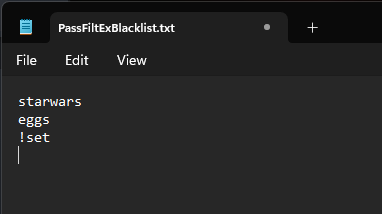
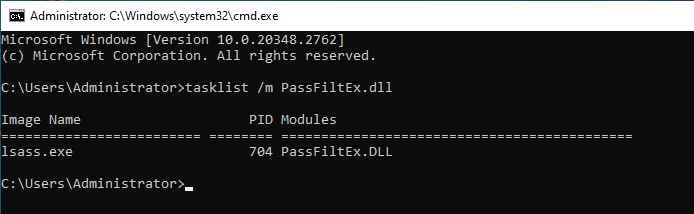

PassFiltEx.c

# PassFiltEx by Joseph Ryan Ries

Author: Joseph Ryan Ries 2019-2025 <ryanries09@gmail.com>,<ryan.ries@microsoft.com>

A password filter for Active Directory that uses a blacklist of bad passwords/character sequences.

Technical Reference: https://msdn.microsoft.com/en-us/library/windows/desktop/ms721882(v=vs.85).aspx

********************************************************************************************
# READ ME

This is a personal project and is NOT endorsed or supported by Microsoft in any way.

Use at your own risk. This code is not guaranteed to be free of errors, and comes

with no guarantees, liability, warranties or support.

********************************************************************************************

Installation:

- Copy PassFiltEx.dll into the C:\Windows\System32 (i.e. %SystemRoot%\System32) directory on your domain controller.

- Copy the PassFiltExBlacklist.txt file into the C:\Windows\System32 (or %SystemRoot%\System32) directory.

- Replace the text file with a list of your own. This project does not include a complete production ready blacklist file - you must supply your own.

- **IMPORTANT:** You MUST go find your own blacklist file. The blacklist file that comes with this project is not
  sufficient to meet your needs on its own. There are many example blacklists of known-bad passwords out there, many hosted right here on GitHub!

- Edit the registry: HKLM\SYSTEM\CurrentControlSet\Control\Lsa => Notification Packages

- Add PassFiltEx to the end of the list. Do not include the file extension. So the whole list of notification packages will read
  "rassfm scecli PassFiltEx" with newlines between each one.

- Reboot the domain controller.

- Repeat the above procedure on all domain controllers.

Operation:

- Any time a user attempts to change his or her password, or any time an administrator attempts to set a user's password, the 
  callback in this password filter will be invoked.

- It is possible to have multiple password filters installed simultaneously.
  All password filters must say yes in order for the password change to be accepted. If any password filter says no, the password change
  is rejected. Therefore, PassFiltEx does not need to check for password length, password complexity, password
  age, etc., because those things are already checked for using the in-box Windows password policy.

- Optionally, you can set the following registry values:

  Subkey: HKLM\SOFTWARE\PassFiltEx
  
    **BlacklistFileName**, REG_SZ, Default: PassFiltExBlacklist.txt

	**TokenPercentageOfPassword**, REG_DWORD, Default: 60
	
	**RequireEitherLowerOrUpper**, REG_DWORD, Default: 0
	
	**MinLower**, REG_DWORD, Default: 0
	
	**MinUpper**, REG_DWORD, Default: 0
	
	**MinDigit**, REG_DWORD, Default: 0
	
	**MinSpecial**, REG_DWORD, Default: 0
	
	**MinUnicode**, REG_DWORD, Default: 0
	
	**BlockSequentialChars**, REG_DWORD, Default: 0
	
	**BlockRepeatingChars**, REG_DWORD, Default: 0
	
	**Debug**, REG_DWORD, Default: 0
	
	
	
	
	
  **BlacklistFileName** allows you to specify a custom path to a blacklist file. By default if there is nothing specified, it is
  PassFiltExBlacklist.txt. The current working directory of the password filter is %SystemRoot%\System32, but you can specify
  a fully-qualified path name too. Even a UNC path (such as something in SYSVOL) if you want. WARNING: You are responsible 
  for properly setting the permissions on the blacklist file so that it may only be edited and viewed by authorized users.
  You can store the blacklist file in SYSVOL if you want, but you must ask yourself whether you want all Authenticated Users
  to have the ability to read your blacklist file.
  
  **TokenPercentageOfPassword** allows you specify how much of the entire password must consist of the blacklisted token
  before the password change is rejected. The default is 60% if nothing is specified. The registry value is REG_DWORD, with 
  the value 60 decimal representing 60%, which is converted to float 0 - 1.0 at runtime. For example, if the character sequence
  starwars appeared in the blacklist file, and TokenPercentageOfPassword was set to 60, then the password Starwars1! would 
  be rejected, because more than 60% of the proposed password is made up of the blacklisted term starwars. However, the 
  password starwars1!DarthVader88 would be accepted, because even though it contains the blacklisted sequence starwars, more
  than 60% of the proposed password is NOT starwars.
  
  As of version 1.5.55, if a line in the blacklist file starts with the ! character, then TokenPercentageOfPassword will be ignored
  for that blacklisted string, and if the password contains that blacklisted string at all, it will be rejected regardless of how
  long the overall password is.
  
  In the following example screenshot, the character sequence "set" is considered to be SUPER-blacklisted, meaning that passwords
  may not contain the character sequence "set" in them at all, whatsoever, regardless of how long the rest of the password is.
  
  	
  
  
  **MinLower/MinUpper/etc.** allows you to specify if you require the user's password to contain multiple instances of any
  given character class. For example setting MinDigit to 2 will require passwords to contain at least 2 digits.
  
  **BlockSequentialChars** 0 means it is off, 1 means it is on. This will block sequences of characters such as 'abc' or '123'.
  
  **BlockRepeatingChars** 0 means it is off, 1 means it is on. This will block repeating sequences of 3 or more e.g. 'aaa' or '111', etc.

  **Debug** 0 means it's off, 1 means it is on. If Debug is on, additional log messages will be written to the log file.
  If Debug is off, then only serious errors will be logged.
  

  
- Comparisons are NOT case sensitive. (Though the final password will of course still be case sensitive.)

- The blacklist is reloaded every 60 seconds, so feel free to edit the blacklist file at will. The password filter will read the 
  new updates within a minute.
  
- Registry settings are re-read every 60 seconds as well so you can change the registry settings without having to restart the whole machine.
  
- All registry settings are optional. They do not need to exist. If a registry setting does not exist, the default is used.

- Unicode support is not thoroughly tested. Everything is assumed ASCII/ANSI. You can still use Unicode characters in your passwords, but Unicode
  characters will not match against anything in the blacklist.

- Either Windows or Unix line endings (either \r\n or \n) in the blacklist file should both work. (Notepad++ is a good editor for 
  finding unprintable characters in your text file.)

- For example, if the blacklist contains the token "abc", then the passwords abc and abc123 and AbC123 and 123Abc will all be 
  rejected. But Abc123! will be accepted, because the token abc does not make up 60% or more of the full password.

- FAQ: Can you/will you integrate with Troy Hunt's "haveibeenpwned" API? Answer: Probably not. First, I'm pretty sure that has
  already been done by someone else. And you are free to use multiple password filters simultaneously if you want. Second, 
  haveibeenpwned is about matching password hashes to identify passwords that have _already_ been owned. This password filter aims
  to solve a slightly different problem by preventing not just passwords that have already been owned, but also preventing the use
  of passwords that could easily be owned because they contain common patterns, even if those password hashes are not known yet.
  
 - NOTE: This binary is not signed with a code signing certificate, which means the DLL will not load if LSA Protection, aka RunAsPPL is enabled.
   Only by getting the module signed by Microsoft as outlined [here](https://learn.microsoft.com/en-us/windows-hardware/drivers/dashboard/file-signing-manage) will the password filter load into lsass if LSA Protection is enabled.

The debug log is \Windows\system32\PassFiltEx.log. A new log file is automatically started once the current log file reaches 1MB.
By default, only error messages are logged. If the Debug registry setting is turned on, then additional informational messages will also be logged.

You can use the command "tasklist /m PassFiltEx.dll" to verify whether the module is indeed loaded into the lsass process. Certain
security features such as RunAsPPL, antivirus, etc., might try to prevent lsass from loading the module.

	

Coding Guidelines:

- Want to contribute? Cool! Just remember: This code ABSOLUTELY MUST NOT CRASH. 
  If it crashes, it will crash the lsass process of the domain controller, which will in turn
  reboot the domain controller. It can even render a domain controller unbootable by putting the system into a boot loop.
  You'd need to boot the machine into a recovery environment and edit the registry offline to remove the password filter from the registry. 
  Therefore, this code must be immaculate and as reliable as you can possibly imagine. Avoid being "clever" and just write "boring", stable code.
  If you don't feel very comfortable with that, just leave me a note on what you want to see added and I'll see about it.
  That means /Wall, /WX and static analyzer at a minimum.
  
